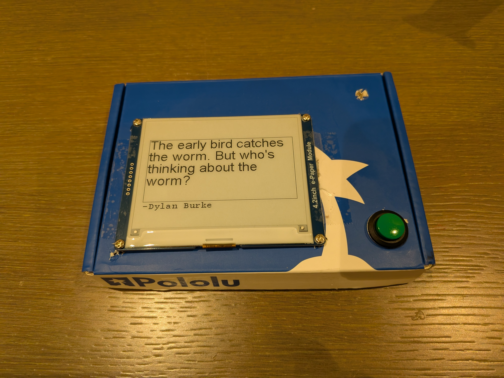
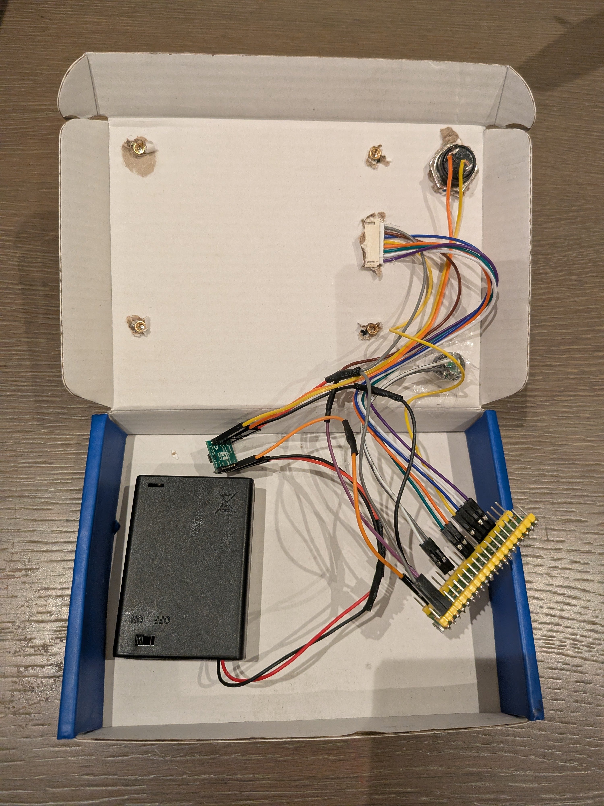
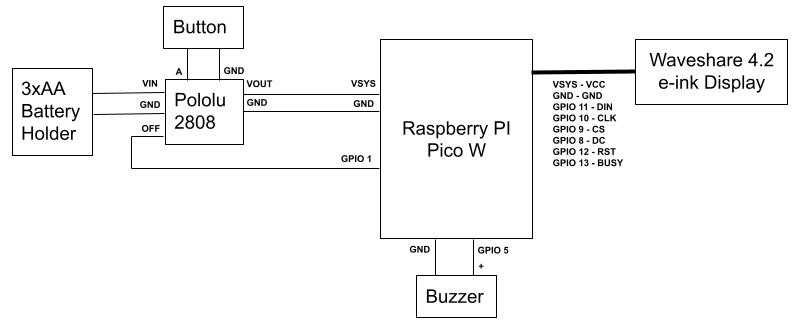

# Pico Wisdom
Displays wise phrases and their authors upon button press. Super long battery life (years).
Built with a Pico W (although Wi-Fi not used) and an e-ink display. Runs off 3xAA through a Pololu push button circuit. Uses a slimmed down, optimized
version (fewer flickers) of Peter Hinch's micropython-nano-gui for graphics. Prototype shown below, designed to be part of an informational picture frame.

&nbsp;&nbsp;&nbsp;

## Parts list
- Raspberry Pi Pico W (although Wi-Fi not currently used) - [Link](https://www.raspberrypi.com/products/raspberry-pi-pico/)
- Pololu 2808 push button circuit - [Link](https://www.pololu.com/product/2808)
- Waveshare 4.2" e-ink display (v2) - [Link](https://www.waveshare.com/4.2inch-e-paper-module.htm)
- Push button - [Link](https://www.amazon.com/dp/B08SKJ6V7Z?ref_=ppx_hzsearch_conn_dt_b_fed_asin_title_1)
- Passive piezo buzzer CYT1008 - [Link](https://www.amazon.com/dp/B01NCOXB2Q?ref_=ppx_hzsearch_conn_dt_b_fed_asin_title_1)
- 3x AA battery holder - [Link](https://www.amazon.com/dp/B0B3YFPB53/ref=sr_1_3?crid=V98JT7CMVI0G)
- Energizer Lithium AA batteries for longer (leak free!) life

## Schematic
Powered by 3xAA batteries through the Pololu 2808. User presses a button wired to Pololu which powers up Pico. A beep is played and a new phrase is selected on boot, different to the last. The Pico will then signal to the Pololu via GPIO 1 to power off. Note that the Waveshare display is powered by the 3.3v output from the Pico (else the voltage will be too high, especially if using 3x Lithium AA batteries which have a nominal voltage of 1.8V). A software watchdog provides an additional safeguard so that the Pico never gets stuck on for a long time.

## Installation
- Firmware: Install UF2 file by holding down BOOTSEL on Pico, connect USB to computer, then drag file on to mounted Pico drive in Finder/Explorer.
- Python code: Install Thonny on desktop/laptop. View->Files and drag all the files (except UF2, JPG, README obvs) on to Pico via Thonny.

## Battery life estimate
Assuming about 10 pushes a day, Pico doing ~40mA and display 24mW, that's about 8 years of battery life. Pololu circuit standby uses .01uA, which would equate to 34,000 years (batteries will degrade before then)! Recommend using lithium AA batteries for longest life. Display will add a "Low battery" when the batteries need changing. 
